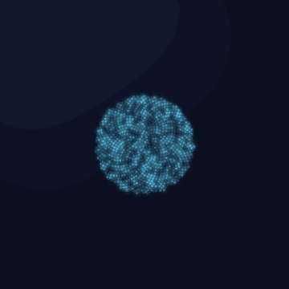
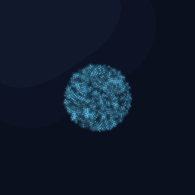
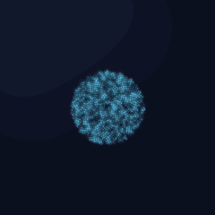
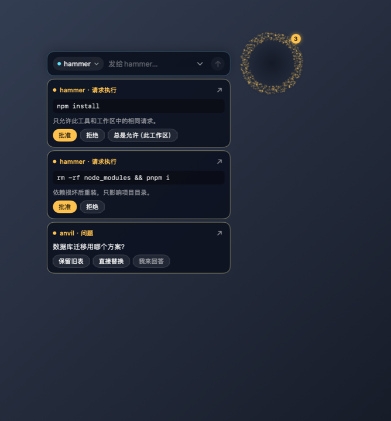

# dsh-harness-jarvis · 贾维斯


贾维斯是常驻桌面的悬浮窗助手，也是一只有状态的桌面宠物：DSH 弹出权限审批时，悬浮窗立刻出现卡片，一键**允许 / 拒绝 / 总是允许（此工作区）**，与主窗口竞答、先到者生效；任何时候按 `⌃⌥J` 就能唤出输入条和他对话，对话记录内嵌面板；启动时他还会出声打招呼。他的本体是一颗随状态呼吸的粒子光球——思考、说话、等你拍板各有动效，拖到屏幕边缘就融进墙里收起，要用时一碰涨回球形。

A resident floating-window desktop assistant — and a living desktop pet — for DSH Desktop: snap-approve permission requests from the orb's card, summon a quick conversation with one shortcut, and get a spoken greeting.

<p align="center">
  
</p>

当前 **0.7.1** 是"助手版"：上面这些能力开箱即用；完整的贾维斯愿景在[路线图](#路线图--roadmap)中继续推进。

## 贾维斯能做什么 / What Jarvis does

- 🔔 **权限审批 / Approvals**：DSH 弹出权限请求 → 悬浮窗出现审批卡片，**允许 / 拒绝 / 总是允许（此工作区）**一键作答；面板与 DSH 主窗口竞答，先到者生效，不必切回主窗口。Answer approvals where they find you — the panel races the DSH window, and the first answer wins.
- ⌨️ **悬浮式对话 / Floating chat**：全局快捷键 `⌃⌥J`（默认，可在面板设置中修改）随时唤出快速输入条，和贾维斯直接聊；对话记录内嵌面板，随点随看。One shortcut summons the input bar, with the history inline.
- 🔊 **语音问候 / Spoken greeting**：启动时贾维斯出声打招呼，问候语与发音人可配置，悬停光球可静音。A configurable, mutable startup greeting.
- ✨ **桌面形象 / Presence**：Metal 粒子光球——五种状态动效、贴边融变、悬停唤醒，像一只安静的桌面宠物待在屏幕角落。A particle orb that breathes with its state — part desktop pet, part status light.

下面这段动图是一次完整交互：`⌃⌥J` 展开输入条、打字发送、贾维斯思考并口播、审批卡片一键允许。The loop below is one full interaction: summon the quick bar, type and send, watch Jarvis think and speak, then allow an approval with one click.

<p align="center">
  
</p>

## 光球与设计稿 / The orb

贾维斯的本体是一颗 Metal 粒子光球：六边形核心，向外两次扩散成环，粒子在环间呼吸。空闲时安静悬浮，思考、说话、等待决策、出错各有一套动效；把它拖到屏幕边缘，光球会"融"进墙里，变成一条贴边的扁条，要用时一碰又涨回球形。

The orb is a Metal particle field — a hex core that diffuses into two rings and breathes between them. Each state (idle, thinking, speaking, attention, error) has its own motion. Drag it to a screen edge and it melts flat into the wall; touch it and it blooms back.

- 交互式设计稿（克隆后本地打开即可看动效）/ Interactive design sketches, open locally after cloning:
  - [docs/design/orb-states.html](docs/design/orb-states.html) — 各状态的粒子动效与实际尺寸对比
  - [docs/design/orb-visual-direction.html](docs/design/orb-visual-direction.html) — 早期视觉方向探索
- 动图由仓库内同款粒子模拟直接渲染，截图由 Snapshotter 生成——均为演示数据，不含真实会话。Animations are rendered from the same particle simulation; screenshots use Snapshotter demo data — never real conversations.

<p align="center">
  
  
</p>
<p align="center"><em>空闲悬浮 · 等待你拍板时的"咚-咚"心跳提醒 / At rest · the attention heartbeat</em></p>
<p align="center">
  
  
</p>
<p align="center"><em>贴边融变收纳 · 审批卡片与工作区预设 / Edge melting · the approval card</em></p>

## 安装 / Installation

当前提供源码安装。面板需要 macOS 14+ 与 Swift 6 工具链（Xcode 或 Command Line Tools）；宿主建议 Node.js 22.18+。Source install for now; the native panel needs macOS 14+ and Swift 6.

1. 构建仓库 / Build from the repository root:

   ```sh
   npm ci
   npm run build
   (cd macos && ./build.sh)
   ```

2. 在你使用的 DSH profile 的 `package.json` 中合并以下条目（把路径换成此仓库的绝对路径，保留原有条目）：

   ```json
   {
     "dependencies": {
       "dsh-harness-jarvis": "link:/absolute/path/to/dsh-harness-jarvis"
     },
     "dsh": {
       "profile": { "bundles": ["dsh-harness-jarvis"] }
     }
   }
   ```

3. 在 profile 目录执行 `pnpm install` 解析 `link:` 依赖（不要在仓库里安装此链接）。插件的 `dsh.bundle.patch` 指向 [cordis.patch.yml](cordis.patch.yml)；插件会自己创建贾维斯会话，不要在 profile 里重复插入同 ID 条目。
4. 在 profile 覆盖配置或 DSH 的贾维斯设置页里，选择你已配置好的 `provider` / `model`（仓库默认 `bailian` / `qwen3.8-max-0902`，不保证与你的环境匹配）。重启 DSH 后执行 `npm run smoke` 验证。Pick a provider/model your DSH already has, restart DSH, then run the smoke check.

硬依赖服务为 `tools`、`userQuestions`、`jobs`；`agentLoop`、`llm`、`systemPrompt`、`webServer`、`settings` 等按可用性接入，缺少时插件降级运行（无 webServer 则没有面板通信入口）。Required: `tools`, `userQuestions`, `jobs`; everything else attaches opportunistically and degrades gracefully.

## 首次使用 / First use

1. 重启 DSH 后，屏幕上出现悬浮光球；按 `⌃⌥J` 唤出输入条即可开始对话。The orb appears after restart; press `⌃⌥J` to start chatting.
2. 下一次 DSH 弹权限审批时，面板会出现审批卡片——点一下即可，也可以回到 DSH 主窗口处理，两边先答先得。The next approval shows up as a card; answer in either surface.
3. 悬停光球可控制声音；展开输入区可查看对话记录。Hover for voice controls; expand for the conversation log.

## 配置 / Configuration

下表列出助手版面向使用者的公开配置，由 `src/index.ts` 的 schema 生成；其余内部字段不对外承诺。路径与身份经 profile 配置；设置页中的 provider/model 改动需重启 DSH，其余开关下次请求即生效。Public-facing fields only; internal fields are not part of the supported surface.

<!-- CONFIG:START -->
| 字段 / Field | 类型 / Type | 默认值 / Default | DSH 设置页 / Settings |
|---|---|---|---|
| `locale` | "zh" / "en" | `"zh"` | 否 / No |
| `audioDir` | string | `"~/.dsh/jarvis"` | 否 / No |
| `ttsBackend` | "edge" | `"edge"` | 否 / No |
| `edgeVoice` | string | `"zh-CN-YunjianNeural"` | 是 / Yes |
| `provider` | string | `"bailian"` | 是 / Yes |
| `model` | string | `"qwen3.8-max-0902"` | 是 / Yes |
| `greetings` | string[] | `[]` | 是 / Yes |
<!-- CONFIG:END -->

`locale` 控制启动问候语言，不是完整的面板双语开关；面板外观与快捷键设置保存在 `~/.dsh/jarvis/panel.json`，连接凭据只写入本机该目录，请勿分享。`locale` is not a full panel translation switch; panel credentials stay local — keep that directory private.

## 与 voice-mini 配合 / Working with voice-mini

voice-mini 可选。可用时贾维斯优先用它的播报与播放控制；不可用时退回内置 edge-tts。静音会抑制播报。voice-mini is optional; Jarvis prefers it when present and falls back to built-in edge-tts.

## 隐私与权限 / Privacy and permissions

审批记录、日志与语音缓存默认保存在本机 `~/.dsh/jarvis`，没有云端存储。**本机存储不等于离线处理**：所配置的模型服务会收到对话上下文，内置 edge-tts 会把播报文本发给 Microsoft 语音服务。Local storage by default; but your configured model provider and the built-in edge-tts service do receive relevant text.

插件不申请 `danger-full-access`；快捷键走 Carbon RegisterEventHotKey，不需要辅助功能按键监听；当前没有麦克风录音。审批记录与日志可能包含敏感操作上下文，请自行管理分享范围。No danger-full-access, no accessibility keyboard monitor, no microphone.

## 路线图 / Roadmap

0.7.x 之后将逐步补齐贾维斯的完整愿景（细节随版本落地再公布）：

- 语音输入（对贾维斯说话，含唤醒词）/ Voice input and wake words
- 预编译面板随 npm 包分发，免本地 Swift 构建 / Prebuilt panel in the npm package
- 会话托管、分级审批与长期记忆等指挥官能力 / Commander capabilities: session coordination, tiered approvals, long-term memory
- 跨平台面板（非 macOS 桌面）/ Panels beyond macOS

## 已知限制 / Known limitations

- 原生面板仅面向 macOS 14+；语音输入与预编译分发尚未完成。macOS-only panel; dictation and prebuilt distribution pending.
- 安全审查与真机验收未完成，暂不声称已通过发布安全验收。Security review and manual acceptance are pending.

## 开发 / Development

```sh
npm ci
npm run build
npm test
(cd macos && swift test && ./build.sh)
npm run docs:config          # 重新生成上方配置表
npm run docs:config -- --check
npm pack --dry-run
```

构建后重启 DSH 再执行 `npm run smoke`。面板改动后重建并重启；截图用演示数据从仓库根目录生成：Restart DSH after building. Screenshots regenerate from demo data:

```sh
JARVIS_SNAPSHOT=/tmp/jarvis-snapshots ./macos/jarvis-panel
```

## 许可证 / License

MIT © 2026 zane — see [LICENSE](LICENSE).
