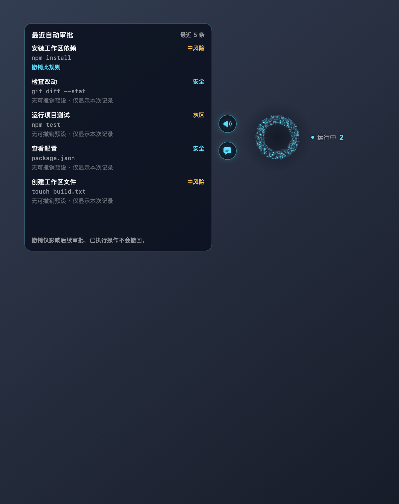

# dsh-harness-jarvis · 贾维斯

DSH Desktop 的会话协调插件：通过 macOS 悬浮面板管理托管任务、审批、播报和本机记忆。

A DSH Desktop plugin that coordinates managed sessions, approvals, spoken updates, and local memory through a macOS floating panel.

## 界面 / Screenshots

以下图片由仓库内的 Snapshotter 使用演示数据生成，不含真实会话。These screenshots use Snapshotter demo data, not private conversations.




## 已实现功能 / Features

功能范围以[待办清单](docs/superpowers/plans/2026-09-24-jarvis-backlog.md)中的“已完成”为准。
Only completed backlog items are described here.

- **会话与任务 / Sessions and tasks（J0、J1、J2、U2）**：创建或恢复贾维斯会话，固定标题；记录任务交接、判断轮末完成情况，在面板显示进度。未完成时先询问用户，得到继续指令后才续做。Creates or resumes Jarvis, tracks delegated tasks and progress, and asks before continuing unfinished work.
- **输出协调 / Output coordination（J4、J5）**：合并临近的完成播报，顺序提问；与 voice-mini 协作，让出已接管会话的轮末播报。Combines nearby completion announcements, queues questions, and avoids duplicate managed-session turn-end announcements with voice-mini.
- **审批 / Approvals（J3、P0、P1）**：面板和 DSH 窗口可竞答，结果异步记入 HTML；可保存及删除工作区预设。分级自动审批默认关闭，启用后仍将高危或不确定请求交给用户，绝不自动拒绝；悬停可看最近五条自动批准及撤销对应预设。The panel and DSH race to answer approvals; results are recorded asynchronously. Workspace presets are revocable. Tiered approval is off by default, falls back to the user, and never automatically rejects.
- **记忆 / Memory（M1、M2、M3、M6）**：`remember` / `recall`、有限字段的临时记录、按版本缓存的长期记忆人设注入。Scoped local storage, explicit remember/recall tools, limited automatic capture, and version-cached long-term memory in the Jarvis prompt.
- **面板 / Panel（U1、H1）**：播报字幕、目标选择、输入与对话记录；默认 `⌃⌥J` 呼出输入框，快捷键可在面板设置中修改。Captions, session targeting, text input, conversation history, and a configurable global shortcut (Control–Option–J).
- **设置与代答 / Settings and answers（J6、J7）**：DSH 设置页；低风险选择题代答默认关闭，超时、非法输出、低置信或选项不匹配均转用户。DSH settings and opt-in low-risk question answering with conservative fallback.
- **运行维护 / Operations（W1、O1、T1）**：面板异常退出后有限次重启、日志轮转、过期播报缓存清理，以及真实 DSH 冒烟脚本。Bounded panel crash recovery, log rotation, speech-cache cleanup, and a host smoke-check script.

## 安装 / Installation

当前提供源码安装流程。预编译面板随包分发（R2）尚未完成；不要假定 npm 包包含面板二进制。
Use a source checkout for the native panel. Prebuilt panel distribution (R2) is not implemented yet.

1. 准备 DSH Desktop、Node.js 和 npm。面板需要 macOS 14+、Swift 6 工具链（Xcode 或 Command Line Tools）。开发测试建议 Node.js 22.18+，以支持直接运行 TypeScript 测试。Install DSH Desktop, Node.js and npm; building the panel requires macOS 14+ and Swift 6. Use Node.js 22.18+ for TypeScript tests.
2. 在仓库目录构建 / Build from the repository root:

   ```sh
   npm ci
   npm run build
   (cd macos && ./build.sh)
   ```

3. 在你使用的 DSH profile 的 `package.json` 中，合并以下依赖和 bundle 条目；把路径换成此仓库的绝对路径，保留原有条目。Merge the dependency and bundle into your active DSH profile; replace the path and keep existing entries:

   ```json
   {
     "dependencies": {
       "dsh-harness-jarvis": "link:/absolute/path/to/dsh-harness-jarvis"
     },
     "dsh": {
       "profile": { "bundles": ["dsh-harness-jarvis"] }
     }
   }
   ```

   在 profile 目录运行 `pnpm install` 解析 `link:`（不是在仓库中运行 npm 安装此链接）。插件的 `dsh.bundle.patch` 指向 [cordis.patch.yml](cordis.patch.yml)，插件自己创建贾维斯 agent；不要重复插入同 ID 的插件行。Run `pnpm install` in the profile directory to resolve the `link:` dependency. The bundle loads `cordis.patch.yml`; Jarvis creates its own agent, so do not insert a duplicate plugin row.

4. 在 profile 覆盖配置或 DSH 的贾维斯设置页选择你已配置的 `provider` / `model`。仓库默认是 `bailian` / `qwen3.8-max-0902`，并不保证你的 DSH 已配置它们。重启 DSH 后执行 `npm run smoke`。Choose a provider/model available in your DSH profile, restart DSH, then run the smoke check.

硬依赖服务为 `tools`、`userQuestions`、`jobs`；`agentLoop` 创建会话，`llm`、`systemPrompt`、`webServer`、`settings` 等按服务可用时接入。没有设置服务时仍使用插件配置；没有 webServer 时没有面板通信入口。
Required injected services are `tools`, `userQuestions`, and `jobs`. Other services attach when available; `agentLoop` creates sessions and `webServer` enables panel communication. Missing settings support falls back to plugin configuration.

## 首次使用 / First use

1. 重启后打开“贾维斯”会话；在面板目标列表中，把需要协调的工作会话“交给贾维斯”。Open the Jarvis conversation, then mark worker sessions as managed in the panel's target list.
2. 用 `⌃⌥J` 打开输入框，选择贾维斯或某个托管目标并输入任务。针对 worker 的输入会先交给贾维斯改写和转发。Choose Jarvis or a managed target and type a task; targeted input is routed through Jarvis.
3. 面板会显示任务进度、审批与提问。可以在面板或 DSH 窗口回答，先到者生效。`总是允许（此工作区）` 仅对允许保存预设的操作显示。Answer in either surface; the first answer wins. The workspace preset button appears only for eligible operations.
4. 悬停可控制声音并查看自动审批记录；展开输入区的对话记录可查看当前目标。说“记住……”使用长期记忆；可让贾维斯调用 `recall` 检索。Hover for voice controls and recent approvals, expand history for the selected target, and ask Jarvis to remember or recall information.

## 配置 / Configuration

下表由 `src/index.ts` 的 `Config` 与 `SettingsSchema` 生成。路径和会话身份通过 profile 配置；设置页中的 provider/model 在重启 DSH 后生效，其余开关按下一次请求生效。
The table is generated from the actual schemas. Configure paths and session identity in the profile; provider/model changes require a DSH restart, while runtime switches apply to subsequent requests.

<!-- CONFIG:START -->
| 字段 / Field | 类型 / Type | 默认值 / Default | DSH 设置页 / Settings |
|---|---|---|---|
| `locale` | "zh" / "en" | `"zh"` | 否 / No |
| `audioDir` | string | `"~/.dsh/jarvis"` | 否 / No |
| `managedFile` | string | `"~/.dsh/jarvis/managed.json"` | 否 / No |
| `tasksFile` | string | `"~/.dsh/jarvis/tasks.json"` | 否 / No |
| `memoryRoot` | string | `"~/.dsh/jarvis"` | 否 / No |
| `approvalsDir` | string | `"~/.dsh/jarvis/memory/approvals"` | 否 / No |
| `lockFile` | string | `"~/.dsh/jarvis/lock.json"` | 否 / No |
| `runtimeFile` | string | `"~/.dsh/jarvis/runtime.json"` | 否 / No |
| `titlePrefix` | string | `"贾维斯-"` | 否 / No |
| `ttsBackend` | "edge" | `"edge"` | 否 / No |
| `edgeVoice` | string | `"zh-CN-YunjianNeural"` | 是 / Yes |
| `archiveIdleDays` | number | `7` | 否 / No |
| `judgeEnabled` | boolean | `true` | 是 / Yes |
| `askInterception` | boolean | `false` | 是 / Yes |
| `autoApprove` | "off" / "safe" / "safe+grey" | `"off"` | 是 / Yes |
| `judgeProvider` | string | `""` | 是 / Yes |
| `judgeModel` | string | `""` | 是 / Yes |
| `judgeTimeoutMs` | number | `20000` | 是 / Yes |
| `maxContinueRounds` | number | `2` | 是 / Yes |
| `provider` | string | `"bailian"` | 是 / Yes |
| `model` | string | `"qwen3.8-max-0902"` | 是 / Yes |
| `jarvisSessionId` | string | `"jarvis"` | 否 / No |
| `jarvisCwd` | string | `"~/jarvis"` | 否 / No |
| `greetings` | string[] | `[]` | 是 / Yes |
<!-- CONFIG:END -->

- `judgeProvider` / `judgeModel` 留空时使用贾维斯的模型；`judgeTimeoutMs` 是毫秒，设置页限制 1000–120000；`maxContinueRounds` 为 0–10。Empty judge fields use Jarvis's model; the settings page bounds timeout and continuation rounds.
- `autoApprove`: `off` 全部询问用户；`safe` 仅只读白名单自动批准；`safe+grey` 允许灰区模型判断，中风险须命中预设或至少两次用户批准且从未拒绝。高危始终交给用户。High-risk operations always require the user, regardless of mode.
- `askInterception` 默认关闭，只为托管会话的低风险选择题尝试代答。Opt-in question interception applies only to low-risk choices in managed sessions.
- `locale` 控制启动问候语言，面板并非完整双语 UI。`titlePrefix`、`archiveIdleDays` 是保留字段，目前不实施 worker 自动改名或按天归档；`ttsBackend` 当前只有 `edge`。These reserved fields do not enable automatic renaming or archival; locale is not a full panel translation switch.
- `memoryRoot` 下保存 `temp/`、`memory/`；`approvalsDir` 可独立配置。`lockFile` 是记忆写入诊断日志，不是跨进程锁。`runtimeFile` 含面板连接凭据，不要分享。Panel appearance and shortcut settings are stored separately in `~/.dsh/jarvis/panel.json`.

## 与 voice-mini 配合 / Working with voice-mini

voice-mini 是可选插件。可用时贾维斯优先调用它的播报与播放控制；不可用时使用内置 edge-tts。更新到支持 `claimsTurnEnd` 和字幕 `text` 信号的 voice-mini，可避免托管轮末重复播报并显示字幕；旧版缺少字幕字段时只是不显示字幕。静音会抑制播报。
voice-mini is optional. Jarvis prefers its speech and playback controls, falling back to built-in edge-tts. Use a version supporting `claimsTurnEnd` and speech `text` signals for coordinated turn-end speech and captions; missing caption fields are tolerated.

## 隐私与权限 / Privacy and permissions

任务台账、托管集合、审批 HTML、记忆、日志和语音缓存默认保存在本机 `~/.dsh/jarvis`。本插件没有另设云端记忆库。**本机存储不等于离线处理**：配置的模型服务会接收相应任务、判断上下文和记忆提示；内置 edge-tts 会把待播报文本发送给 Microsoft 语音服务。voice-mini 的处理方式取决于其后端配置。
Task records, approvals, memory, logs and audio caches are stored locally by default. Local storage does not imply offline processing: configured model providers receive relevant context, and built-in edge-tts sends speech text to Microsoft's service. voice-mini follows its selected backend.

插件不申请 `danger-full-access`。快捷键使用 Carbon RegisterEventHotKey，不要求辅助功能全局按键监听权限；当前没有麦克风录音或语音输入。自动代答与自动审批均默认关闭。审批记录和日志可能包含敏感操作上下文，请自行管理本机文件及分享范围。
The plugin does not request danger-full-access. The Carbon hotkey does not require accessibility keyboard monitoring. There is no microphone capture or speech input. Automatic answers and approvals are disabled by default; local records can contain sensitive task context.

## 已知限制 / Known limitations

- 原生面板仅面向 macOS；语音输入 S0/S1、通用预编译分发 R2 尚未完成。The native panel targets macOS; dictation and universal prebuilt distribution are pending.
- SEC1 安全审查与 Q1 真机验收尚未完成，不声称已经完成发布安全验收。SEC1 security hardening and Q1 manual acceptance remain pending.
- 自动分类是保守规则与可选模型判断，不是命令执行沙箱；无法确定的操作仍交给用户。撤销预设只影响后续审批，不撤销已执行的操作。Classification is not an execution sandbox, and revoking a preset does not undo completed operations.
- 自动记忆整理/固化 M4/M5 暂缓；唤醒词和跨平台面板不在当前范围。Memory consolidation, wake words and cross-platform panels are not shipped capabilities.

## 开发 / Development

```sh
npm ci
npm run build
npm test
(cd macos && swift test && ./build.sh)
npm run docs:config          # rebuild and regenerate the configuration table
npm run docs:config -- --check
npm pack --dry-run
```

构建后重启 DSH，再执行 `npm run smoke`；可选 `npm run smoke -- --write` 会临时切换一个未托管会话并尝试恢复原状态，失败时按脚本提示处理。不要在未重启 DSH 时把冒烟结果当成新代码验证。
Restart DSH after building, then run `npm run smoke`. Optional `--write` temporarily changes one unmanaged session and attempts to restore it; follow any recovery message if restoration fails.

面板改动后重建并重启；截图从仓库根目录生成。Snapshot mode uses demo data and exits after rendering:

```sh
JARVIS_SNAPSHOT=/tmp/jarvis-snapshots ./macos/jarvis-panel
```

配置表修改后应重新生成并运行测试。包内容检查应包含 README、LICENSE、`lib/`、`cordis.patch.yml`，以及文档截图和内置 TTS 脚本；面板二进制仍由 R2 处理。
Regenerate the configuration table when schemas change. Check package contents before release; native binary distribution remains a separate backlog item.

## 许可证 / License

MIT © 2026 zane — see [LICENSE](LICENSE).
